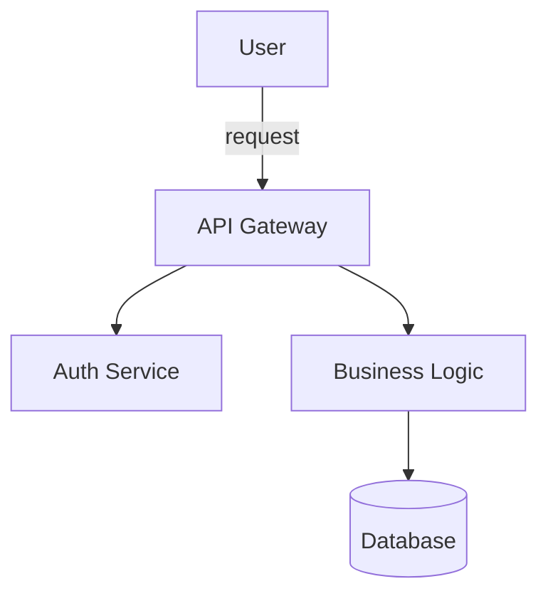

# Skill: beautiful-mermaid

> **用途**：生成美觀、清晰的 Mermaid 圖表（架構圖、流程圖、序列圖、ER 圖）。
> **觸發**：`/beautiful-mermaid`

## 能力範圍

- 系統架構圖（C4 風格）
- 資料流程圖
- 序列圖（agent interactions）
- ER 圖（資料模型）
- 狀態機圖

## 設計原則

- 使用語義化節點命名
- 添加適當的顏色主題
- 保持圖表可讀性（不超過 20 節點）
- 每個圖表附說明文字

## 使用方式

```
/beautiful-mermaid [圖表類型] [描述]
```

## 輸出範例


